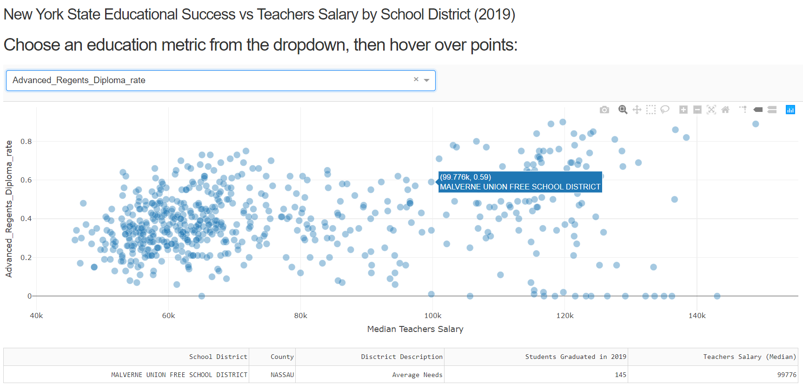

# New York State School District Success
Aim of project: determine if a relationship exists between School Districts’ student success and Teachers’ Salary in New York State using a python Dash App.
- Created: 5/14/20
- view python Dash App here: https://nys-student-success.herokuapp.com/

## About the Dataset:
The dataset was gathered from two sources:
- NYSED: https://data.nysed.gov/downloads.php
- Empire Center: https://www.seethroughny.net/teacher_pay

Then, the data was merged, cleansed, and explored with python here: https://github.com/odonnell31/NYS_School_District_Success/blob/master/data_analysis/data_analysis_v1.py

## Data Parameters:
1.	Location: New York State public school districts only
2.	Time Frame: all statistics and numbers are based on the 2018-2019 school year
3.	Outlier handling: removed all New York State public school districts that did not graduate at least one student in 2019
4.	Data points: each data point (in scatter plot) is one New York State school district
5.	Scatter Plot x-axis: The x-axis of the scatter plot is the Median Teachers’ Salary by School District (independent variable). This remains constant regardless of user interaction.
6.	Scatter Plot y-axis: The y-axis of the scatter plot is the measure of student success (dependent variable), which the user chooses in the above dropdown.

## More details about project
A writeup of this project that documents the process from beginning to end can be found in this word document: https://github.com/odonnell31/NYS_School_District_Success/blob/master/Final_Project_ODONNELL.docx

## Data Science tools used
- python
- pandas
- dash

